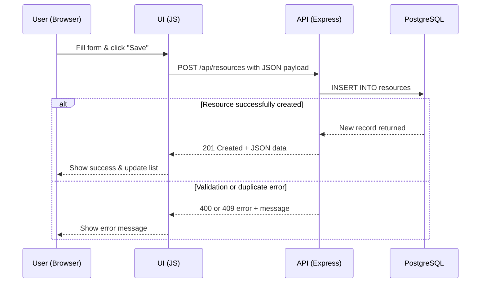
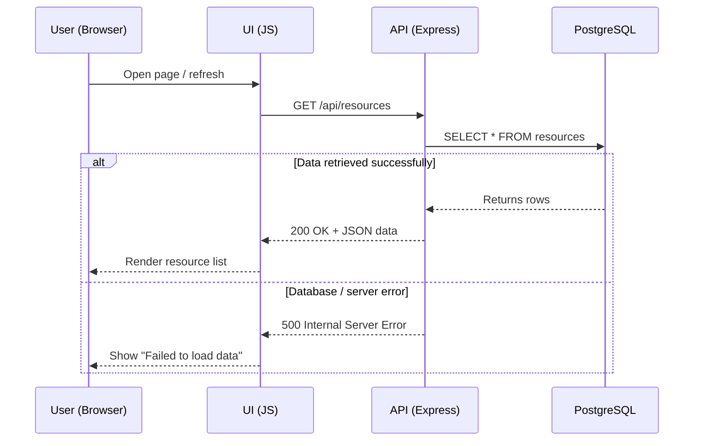
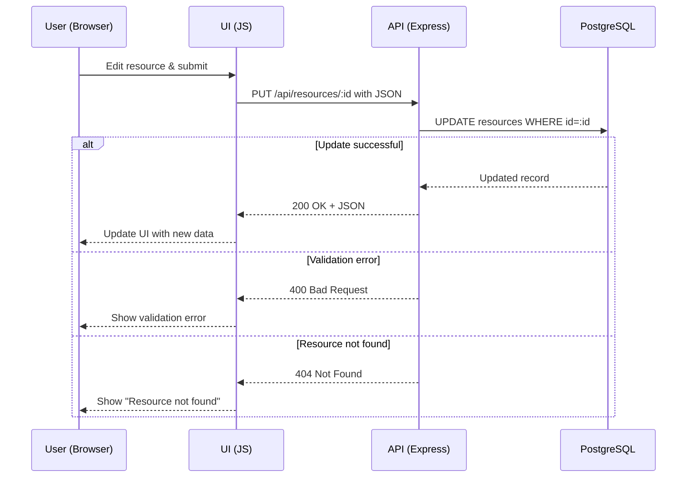
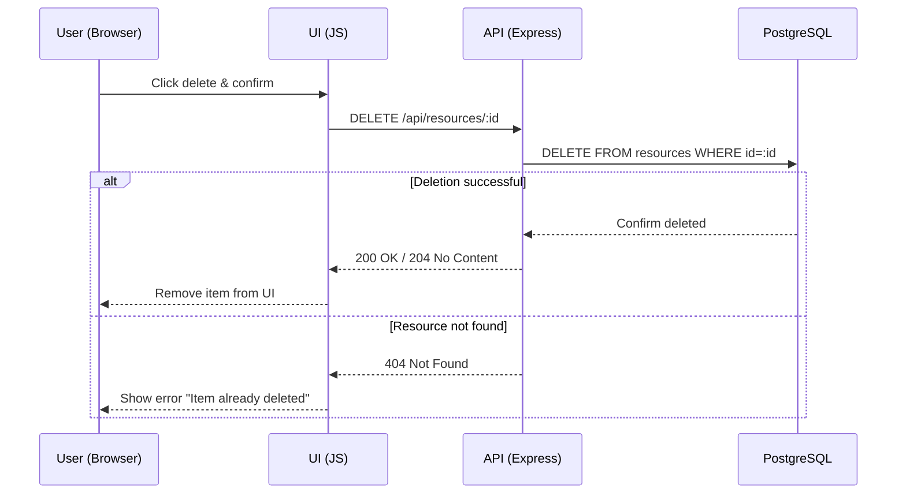

# Booking System: CRUD Data Flow (Alternative Version)

This version shows the same Create, Read, Update, Delete operations using slightly different diagram conventions.

## 1. CREATE (C)

## 2. READ (R)

    
## 3. UPDATE (U)

## 4. DELETE (D)

